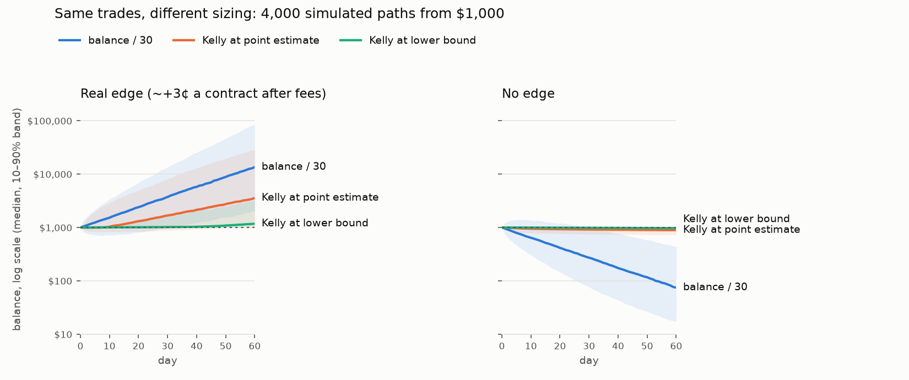

# kalshi-trading-infra

[](https://github.com/charlesfales/kalshi-trading-infra/actions/workflows/ci.yml)

The execution, risk, and research infrastructure behind the automated strategies I've run
with real money on [Kalshi](https://kalshi.com) since May 2026.

**What's here:** the parts I'd want any trading system to have. Request signing, fail-closed
risk gates, sizing that can't chase luck, honest statistics for binary-contract track
records, pre-registration, and ledger reconciliation. All of it is tested.

**What isn't:** the strategies. Pricing models, signals, entry thresholds, the markets I
trade, and live results stay private. I'm happy to walk through them in an interview.

## Modules

| module | what it does |
|---|---|
| `auth.py` | RSA-PSS request signing for the Kalshi v2 API. Has a startup self-test, so a bot that can't sign refuses to start instead of finding out on its first order. |
| `lock.py` | Single-instance PID lock. Two copies of a bot means double the size anyone decided on. Handles two Windows traps: a truncated `HANDLE`, and `os.kill(pid, 0)` actually *terminating* the process. |
| `risk.py` | Pre-trade gates, all checked immediately before submit: master switch (off by default), latching kill file, daily loss limit, position and contract ceilings, a dollar stake cap, slippage between signal and submit, input staleness, time-to-expiry window, and a venue-latency gate. |
| `sizing.py` | Proportional stake with a floor, a cap and a drawdown tier, plus a fail-closed reader for the stake fraction the record justifies. |
| `stats.py` | Day-block bootstrap CIs, a market-implied null (Poisson-binomial over entry prices), and Kelly sizing evaluated at the CI **lower bound**. |
| `prereg.py` | Pre-registered candidates (hypothesis, mechanism, falsifier, sample target) scored PASS / FAIL / UNDECIDED from forward data only. |
| `ledger.py` | Aggregates partial fills per order and reconciles the ledger to the account balance in exact `Decimal`. |
| `book.py` | Order books rebuilt from the `orderbook_delta` channel. Handles bids-not-asks (`yes_ask = 1 - best_no_bid`), invalidates every book on a subscription after a sequence gap, treats unseeded sides as unknown rather than empty, uses exact integer price ticks, and checks itself against REST ground truth. |
| `ws_feed.py` | Authenticated WebSocket feed: reconnects with backoff and resubscribes any invalidated market for a fresh snapshot. A broken book answers `None`, so you can't trade on one. |
| `replay.py` | Event replay that runs the **same** `Strategy.decide` the live loop runs. Events are ordered by receive time, series are readable only as-of now, and fills happen against the book *after* latency, IOC to the limit. `estimate_lead_lag` checks recordings for clock offsets before a backtest joins them. |

## Research and docs

- **[Sizing study](docs/SIZING_STUDY.md).** A Monte Carlo of four sizing policies in a world with a real edge and a world with none. Lower-bound Kelly almost never draws down in either, and the study shows what that insurance costs in growth.
- **[Pre-registration template](docs/PREREGISTRATION_TEMPLATE.md).** The form every candidate rule fills in before forward data is scored.
- **[`examples/example_bot.py`](examples/example_bot.py).** A placeholder strategy replayed end to end on synthetic markets: book, replay, latency, settlement, fees, then a mechanical verdict. The placeholder is handed the true fair value while the book is quoted with noise, so it has a known edge by construction, and the harness finds it: `PASS`, +3.0¢ a contract, 90% CI [+1.0, +5.1].

[](docs/SIZING_STUDY.md)

## How I work

1. **Mechanism first.** A rule needs a reason the edge should exist (contract structure,
   microstructure, who is on the other side) before it gets tested.
2. **Pre-register.** Hypothesis, falsifier and sample-size target are frozen before forward
   data arrives. Changing a frozen rule restarts its clock.
3. **One contract until proven.** New rules trade minimum size. "Buying" the missing data
   at one contract beats simulating it.
4. **Size off the lower bound.** Kelly at the CI lower bound, scaled down and capped. The
   stake rises as evidence accumulates, not as the point estimate gets lucky.
5. **Distrust the backtest.** Replay the production code path, reconcile every source row,
   and check clocks for look-ahead before believing an edge.

## Lessons that shaped this code

- **Sizing on a good streak is how you give it back.** I scaled one strategy up on a strong
  point estimate while its interval still included zero, and the drawdown that followed is
  why `stats.stake_state` sizes off the lower bound and fails closed at every exit.
- **Percentiles lie on small samples.** A "p99 latency > cap" gate is really a one-blip
  rule until there are 100 samples, because nearest-rank p99 is the max. `risk.py` counts
  slow samples instead.
- **Trades cluster by day.** An IID bootstrap gave intervals that were far too tight.
  `block_ci` resamples whole days and refuses to produce an interval from fewer than three.
- **A row is evidence only if someone was charged for it.** Cancelled and resting orders
  once leaked into a record priced at their aim. The record is now built from fills and
  reconciled to the cent.
- **Check the book against ground truth.** A book rebuilt from deltas can drift quietly
  if one assumption about the feed is wrong. `OrderBook.verify` compares it with an
  independent REST read and invalidates it on drift.
- **Recorder clocks lie.** A feed recorded a fraction of a second late makes a backtest
  read the future without any bug in the strategy. `estimate_lead_lag` finds the offset.
- **Money arithmetic happens in cents.** `25.0 * 1.10` is `27.500000000000004`, and
  `10 // 0.40` is `24`.

## Running the tests

```bash
pip install -e ".[dev]"
pytest                                  # 52 tests
python examples/example_bot.py          # end-to-end replay on synthetic markets
pip install -e ".[research]" && python research/sizing_study.py
```

## Contact

Charles Fales · [linkedin.com/in/charles-fales](https://linkedin.com/in/charles-fales)
